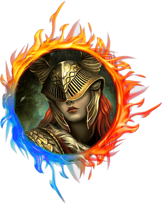

# [my.Github](https://www.github.com/starbjornx) - [my.Twitter](https://www.twitter.com/starbjornx) - [this.Website](https://www.placeholder.com)

<html>
<body>

<h1 align="center" style="positiion: relative;">

  <br>
  <a href="https://www.github.com/starjornx"></a>


  <br>
  Elden Brothers
  <br>
</h1>

<h4 align="center">Elden Ring Market</h4>

<p align="center">
  <a href="https://badge.fury.io/js/electron-markdownify">
    
  </a>
  <a href="https://gitter.im/amitmerchant1990/electron-markdownify"></a>
  <a href="https://saythanks.io/to/khenriksenbootcamp@gmail.com">
      
  </a>
</p>

<p align="center">
  <a href="#key-features">Key Features</a> •
  <a href="#how-to-use">How To Use</a> •
  <a href="#download">Download</a> •
  <a href="#credits">Credits</a> •
  <a href="#authors">Authors</a> •
  
</p>


## Key Features

-Admin will be able to update player details and stats.

## How To Use

To clone and run this application, you'll need [Git](https://git-scm.com) and [Node.js](https://nodejs.org/en/download/) (which comes with [npm](http://npmjs.com)) installed on your computer. From your command line:

```bash
# Clone this repository
$ git clone https://github.com/bhodge166/project2.git

# Go into the repository (cloning will create a new folder inside the folder you are in so "LS" and see what the name is CD into that file name and then follow remaining instructions.)
$ cd project2

# Install dependencies
$ npm install

# Run the app
$ npm start
```

Note: If you're using Linux Bash for Windows, [see this guide](https://www.howtogeek.com/261575/how-to-run-graphical-linux-desktop-applications-from-windows-10s-bash-shell/) or use `node` from the command prompt.

## Download

You can [download](https://nodejs.org/en/download/) the latest installable version of node js for Windows, macOS and Linux.

## Credits

This software uses the following open source packages:

- [Node.js](https://nodejs.org/)
- [express v4.17.3](https://www.npmjs.com/package/express)
- [mysql2 v2.3.3](https://www.npmjs.com/package/mysql2)
- [bcrypt v5.0.1](https://www.npmjs.com/package/bcrypt)
- [connect-session-sequelize v7.1.2](https://www.npmjs.com/package/connect-session-sequelize)
- [dotenv v16.0.0](https://www.npmjs.com/package/dotenv)
- [express-handlebars v6.0.3](https://www.npmjs.com/package/express-handlebars)
- [express-session v1.17.2](https://www.npmjs.com/package/express-session)
- [handlebars v4.7.7](https://www.npmjs.com/package/handlebars)
- [sequelize - v6.17.0](https://www.npmjs.com/package/sequelize)
- [heroku - latest version](https://www.heroku.com)
- [jshint v2.13.4](https://www.npmjs.com/package/jshint)

## Authors

This design is put together by:

<div style = "display: flex; flex-wrap: wrap">

<div>


[Jake Eissler](http://github.com/jakeeis24)

</div>

<div>


[Kyle Henriksen](http://github.com/starbjornx)

</div>

<div>


[Peter Riggs](http://github.com/par92)

</div>

<div>


[Brad Hodge](http://github.com/bhodge166)

</div>
</div>

# Extra

## License

## MIT

</body>
</html>
